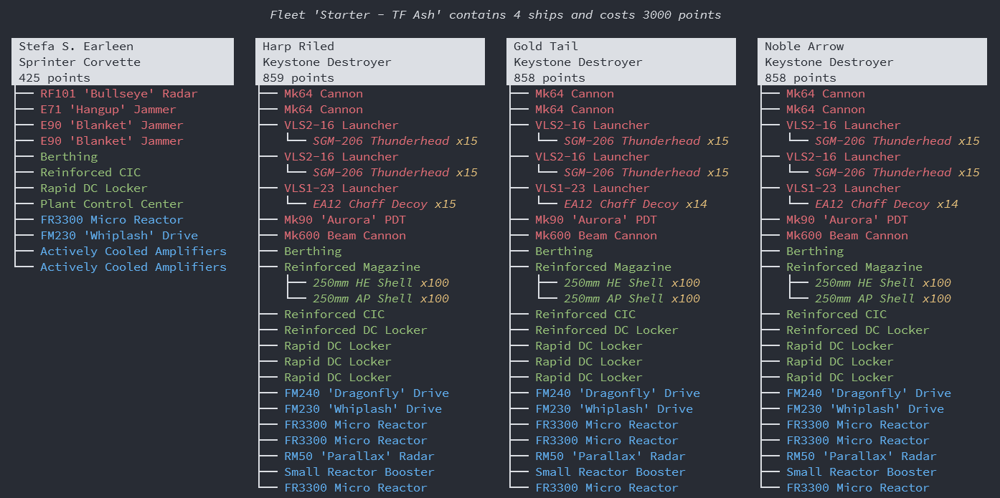
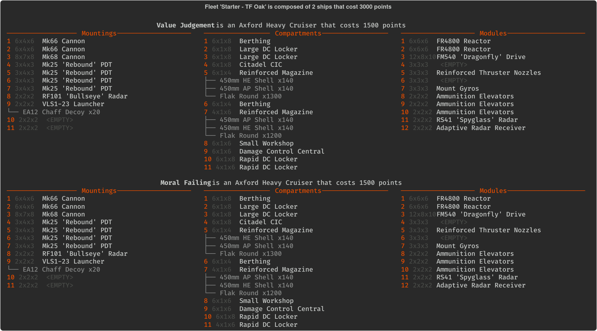

# Neboulous Fleet CLI

A CLI tool to pretty print fleet files to console. Can write output as image, and provides a Discord bot on top.





## Requirements, Installation and Execution

Until the application is packaged and released, you will need to use code from this repository directly.

Clone this repository, or download it as an archive. The minimal requirements are:

- Python 3.8+
- Poetry (dependency manager)
- libcairo2 (system library)
- Recommended: fonts-firacode

To install, run:

```sh
poetry install
```

And to execute, run:

```sh
poetry run nfcli -i your_file.fleet -p
```

If unsure, run:

```sh
poetry run nfcli -h
```

## Running the bot

- Create a new Application via <https://discord.com/developers/applications>
- Configure `Bot` section and generate a `TOKEN`
- Invite the bot to your server
- Edit `.env.dist` and save it as `.env`
- Run `poetry run bot` and enjoy your new bot
